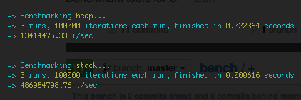

bench
=====

> Bench is a C benchmarking utility. Forked from [c9s/bench](https://github.com/c9s/bench).



#### Usage
Here is an example. You can view a full example [here](./example.c).
```c
#include "bench.c"

void example_benchmark() {
    BENCHMARK(example_bench, 3)

   	// All the code you want to benchmark

    END_BENCHMARK(example_bench)
    BENCHMARK_SUMMARY(example_bench);
}

void example_measure() {
    MEASURE(example_measure)

   	// All the code you want to measure

    END_MEASURE(example_measure)
    MEASURE_SUMMARY(example_measure);
}
```
